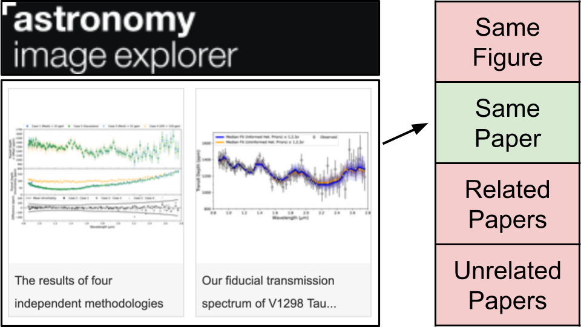

# AstroCLIMB:  
## Astronomy Citation Linking from Illustrations: a Multimodal Benchmark

### Motivation
Scientists rely on figures to share their discoveries, but this makes the information contained in the figures hard to parse, archive, and search. Recent multimodal neural-network models promise to extract this information, but have not yet been widely tested and adopted by the astronomy community.  
In partnership with [astroexplorer.org](https://www.astroexplorer.org/), we propose a novel dataset and an associated task as a benchmark to evaluate a model’s multimodal capabilities.  The task is to partially reconstruct the citation graph of astronomy papers solely from their figures and captions.

The dataset consists of over 100K figure+caption from the [astroexplorer.org](https://www.astroexplorer.org/) from recent open access astronomy papers.



### Task Description
The goal of the task is multi-class, single-label classification.
The inputs are pairs of objects. It could be two figures, a figure and a caption, or two captions.
The possible outputs are:
- `same paper` if the two objects originated from the same scientific paper (they have the same DOI).
- `related papers` if the two objects originated from related papers (one object's DOI cites the DOIs of the second object).
- `same figure` if the two objects are actually from the same scientific figure (only for figure+caption pairs).
- `unrelated papers` if the two objects originated from unrelated papers (none of the previous cases).

Input pairs only have one label and the relations between objects is symmetrical.  

This dataset is imagined by the authors to be more of a benchmark for multimodal models, rather than a meaningful task in itself.  As such, participants are not necessarily  expected to fully train large models solely for AstroCLIMB. Basic statistics or incorporation into a larger multimodal training process seem more appropriate.  

### Datasets
For this task, there are two versions of the same dataset:
- The full dataset on Huggingface [here](https://huggingface.co/datasets/adsabs/AstroCLIMB). This version consists of over 100K rows containing a figure, its caption, and relevant metadata such as source DOI, authors, related DOIs and more, which describe a citation graph of astronomy papers with an adjacency list. This version of the dataset does not list out pairs, as there are too many. 
- A partial evaluation dataset on Kaggle [here](https://www.kaggle.com/competitions/astroclimb/overview). This version lists out 10K pairs in each the train and test set. Many more pairs can be generated from the full dataset from the adjacency list described in the full dataset above.

#### Huggingface Dataset
```
Dataset({
    features: ['image', 'UUID', 'Image ID', 'Paper DOI', 'Paper Title', 'Image Caption', 'Image Authors', 'References DOIs', 'Citing DOIs'],
    num_rows: 94233
})
```
(test set  to be released in November 2026)
- `images` are stored as PIL PNG objects.
- `Image Caption` are English language text.
- `UUID`, `Image ID`, `Paper DOI`, `Paper Title` are metadata.

A more complete descriptions of the features can be found [here](https://ui.adsabs.harvard.edu/WIESP/2026/shared_task_labels).

#### Kaggle Dataset
```
id,same_figure,same_paper,related_papers,unrelated_papers,obj_1,obj_2
...
122,0,1,0,0,Distribution of stars in Fornax–Horol[...], n+avHx8atWrU5/tOfPn7/rrr[...]
123,0,0,1,0,Distribution of the RVs for TOI-2046b[...], iVBORw0KGgoAAAANSUhEUgAA[...]
...
```
Both the training and the test set are built from the full dataset and consist 10K pairs of objects along with their binary classification.  
- `obj_1`, `obj_2` are the input features. Some of these are English language character strings, others are images encoded as strings and need to be converted to PIL images. The code to detect and convert to images is available as a notebook [here](https://www.kaggle.com/code/felixgrezes/loading-encoded-images)
- `same_figure`, `same_paper`, `related_papers`, `unrelated_papers` are the target classes.
- `id` identifies the pair. This is needed for your `submission.csv` when using the evaluation pairs in `test.csv`.

A more complete descriptions of the features can be found on Kaggle [here](https://www.kaggle.com/competitions/astroclimb/data).


### Evaluation
The challenge is being evaluated on Kaggle [here](https://www.kaggle.com/competitions/astroclimb/overview).  
Models will be evaluated using macro-F1 score over the 4 target classes.
Submissions should be formatted in a `.csv` file as follows:
```
id,same_figure,same_paper,related_papers,unrelated_papers
0,0,1,0,0
1,1,0,0,0
2,0,1,0,0
...
```
A full sample submission can be found [here](https://www.kaggle.com/competitions/astroclimb/data?select=sample_submission.csv).


## Instructions for Participants
1. Participants should register for AACL-IJCNLP [here](https://2026.aaclnet.org/calls/workshops/).
2. Participants should join the competition on Kaggle [here](https://www.kaggle.com/competitions/astroclimb/overview), where they can find the latest version of the dataset, and score their submissions.
3. Participants should format their papers using the ACL LaTeX template on Github [here](https://github.com/acl-org/acl-style-files/tree/master?tab=readme-ov-file), and submit them to OpenReview [here](https://openreview.net/group?id=aclweb.org/AACL-IJCNLP/2026/Workshop/WASP).  


## Timeline 
(subject to change)  

| Timeline                          | Date                |
|-----------------------------------|---------------------|
| 1st CfP + Registration starts     | July 27             |
| Train and Scoring Test set Release| July 27             |
| Registration Ends                 | September 12        |
| System Run and Output Submission  | September 13        |
| System Paper Submisison           | September 14        |
| Result Announcement               | October 1           |
| Camera Ready Submission           | October 12          |
| Full Data Release                 | November 9-10       |
| Workshop                          | November 9-10       |

*All deadlines are 11.59 pm UTC-12h ("Anywhere on Earth").*

### Contact
For inquiries, contact Felix Grezes at [felix.grezes@cfa.harvard.edu](mailto:felix.grezes@cfa.harvard.edu)
