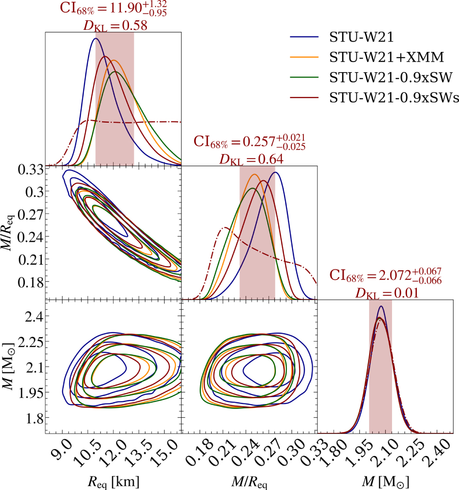

### Dataset Details

#### [Huggingface Dataset](https://huggingface.co/datasets/adsabs/AstroCLIMB) 
The full training dataset looks like this:
```python
Dataset({
    features: ['image', 'UUID', 'Image ID', 'Paper DOI', 'Paper Title', 'Image Caption', 'Image Authors', 'References DOIs', 'Citing DOIs'],
    num_rows: 94233
})
```

Taking a look at the first row, we see the following:
```python
train_dataset[0] == 
{image': <PIL.PngImagePlugin.PngImageFile image mode=RGB size=1000x1066>,
'UUID': '10.3847.1538-4357.ac983d_apjac983df5_8',
'Image ID': 'apjac983df5',
'Paper DOI': '10.3847/1538-4357/ac983d',
'Paper Title': 'The Radius of PSR J0740+6620 from NICER with NICER Background Estimates',
'Image Caption': 'Effect of the SW background estimate on the mass and radius posterior distributions using the W21 data set conditional on the ST-U model. Also, the posteriors for compactness GM/R eq c 2 are shown (hereafter and in the figure referred as M/R eq, i.e., assuming c = 1 and G = 1). Four types of posterior distribution are shown: one conditional on the NICER likelihood function with a smoothed SW background lower bound (STU-W21-0.9xSWs); one similar but with a non-smoothed lower bound (STU-W21-0.9xSW); one conditional on NICER likelihood function without background constraints (STU-W21); and one conditional on the NICER and XMM-Newton likelihood function (STU-W21+XMM). The last two are from R21. The marginal prior PDFs are shown by the dashed–dotted functions. We report the credible intervals and the Kullback–Leibler divergence D KL for the NICER posterior conditional on the smoothed SW estimate lower bound (for the other cases, see Table 6). The shaded intervals contain 68.3% of the posterior mass, and the contours in the off-diagonal panels contain 68.3%, 95.4%, and 99.7% of the posterior mass. See the caption of Figure 5 of R21 for additional details about the figure elements.',
'Image Authors': 'Authors: Tuomo Salmi, Serena Vinciguerra, Devarshi Choudhury, Thomas E. Riley, Anna L. Watts, Ronald A. Remillard, Paul S. Ray, Slavko Bogdanov, Sebastien Guillot, Zaven Arzoumanian, Cecilia Chirenti, Alexander J. Dittmann, Keith C. Gendreau, Wynn C. G. Ho, M. Coleman Miller, Sharon M. Morsink, Zorawar Wadiasingh, Michael T. Wolff',
'References DOIs': ['10.3847/1538-3881/ac4ae6'],
'Citing DOIs': ['10.3847/2041-8213/ace5b2',
'10.3847/2041-8213/ad5beb',
'10.3847/1538-4357/ae145d',
'10.3847/1538-4357/ad81d2',
'10.3847/1538-4357/acf9a0',
'10.3847/1538-4357/ad7255',
'10.3847/2041-8213/ad9f3c',
'10.3847/2041-8213/ad5f02',
'10.3847/1538-4357/acf49d',
'10.3847/2041-8213/ad5a6f']}
```

Going through each of these:
- `'image': <PIL.PngImagePlugin.PngImageFile image mode=RGB size=1000x1066>` is the image data for this figure, rendered below.  


- `Image Caption` is the other important feature of this row. It is the text caption associated with this figure.
- `References DOIs` and `Citing DOIs` are lists that link to other DOIs which are either referenced by or cite the current row's DOI.  
- `'UUID': '10.3847.1538-4357.ac983d_apjac983df5_8'` serves as a unique identifier for the row.  
- `'Paper DOI': '10.3847/1538-4357/ac983d'` is the [Digital Object Identifier (DOI)](https://www.doi.org/) of the paper from which the figure was extracted.   
- `'Image ID': 'apjac983df5'` is an identifier to distinguish from other figures in the paper.  
- `Paper Title` and `Image Authors` provide potentially useful metada.  

From the `References DOIs` and `Citing DOIs` columns we can build the version of the dataset used on Kaggle


### [Kaggle Dataset](https://www.kaggle.com/competitions/astroclimb/overview)
With over 100K rows in the full dataset (train+test), there are over 5B possible pairs of objects. The version of the dataset on Kaggle contains a small, balanced sample of those pairs.  
`train.csv` contain 10K rows with 1K sample for each combination possible of `image+image`, `image+caption`, `caption+caption` input features with `same_figure`, `same_paper`, `related_paper`output labels.   
```csv
id,same_figure,same_paper,related_papers,unrelated_papers,obj_1,obj_2
122,0,1,0,0,Distribution of stars in Fornax–Horol[...], n+avHx8atWrU5/tOfPn7/rrr[...]
123,0,0,1,0,Distribution of the RVs for TOI-2046b[...], iVBORw0KGgoAAAANSUhEUgAA[...]
[...]
```

When `obj_1` or `obj_2` are images, they are encoded as strings. To properly load them as PIL images, follow the instructions [here](https://www.kaggle.com/code/felixgrezes/loading-encoded-astroclimb-images).


